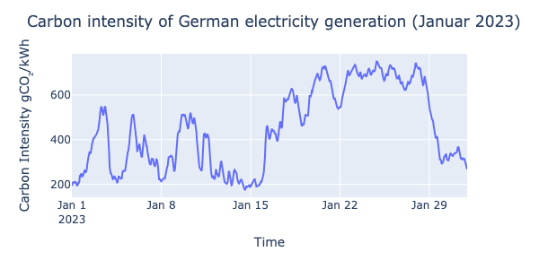

# co2_scheduler
Demo of a web app to optimize the schedule of electricity-intensive tasks to reduce the CO2 footprint.

[Here](data/co2_scheduler_demo.webm) is a short video to showcase the main functionality.
[Watch the CO2 Scheduler Demo Video](https://raw.githubusercontent.com/cliedl/co2_scheduler/main/data/co2_scheduler_demo.webm) 

The app is currently deployed on [co2-scheduler.streamlit.app](co2-scheduler.streamlit.app), but might not be maintained in the future.

Feel free to experiment!

## Project description
In 2023, the share of renewable electricity generation in Germany reached about 50%. Most of the renewable energy share comes from wind and solar, which are strongly varying throughout the day due to varying wind speeds and solar radiation. Therefore, the CO2 impact of electricity generation also fluctuates a lot:

Here, we show the carbon intensity of Germany electricity generation for January 2023, i.e., how many gramms of CO2 are emitted per kilo Watt hour (kWh) of generated energy. 
This number fluctuates a lot, it changes between about 200gCO2/kWh and 800gCO2/kWh!

### Project goal: 
The goal of this project was to build a web application to optimize the scheduling of electricity-heavy tasks to reduce their CO2 impact.

### Streamlit app
* First, we retrieve the weather forecast and use the model to predict the Co2 impact of electricity generation for the next five days:
* Then, the user can add tasks from a dropdown menu and select the time and duration of each task
* The CO2 footprint is then calculated, and an optimized schedule is proposed. The progress bar visualizes how close the selected schedule is to the optimal schedule.

### Model
We trained an XGBoost model to predict the carbon intensity of electricity generation based on the forecast of regional weather data. 
#### Data
* Historical wind speeds: [Deutscher Wetter Dienst API](https://dwd.api.bund.dev/)
* Historical carbon intensity: [Electricity Maps](https://app.electricitymaps.com/map)
* Wind speed forecast API: [Open Weather Map](https://openweathermap.org/)

## To host the app locally: 
* Clone repository and navigate to repository folder
    * git clone <repository_url>
    * cd <repository_directory>
* Create virtual environment and activate (e.g., with conda):
    * conda create -n some_name python=3.10
    * conda activate some_name
* Install requirements.txt
    * pip install -r requirements.txt
* Run streamlit app
    * streamlit run co2_scheduler.py

